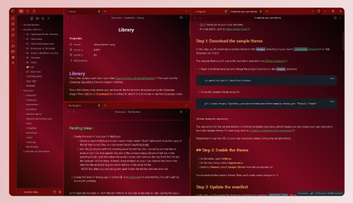

# Rose Red Theme for Obsidian

A Red Gradient Dark theme for Obsidian, compatible with Obsidian V1.4.13 and above.

## Install

The Theme is available on the Obsdian Theme Marketplace. Install and Enjoy !

### Install Manually

To manually install the theme from my release on github, follow below steps :

1. Download the two files `theme.css` and `manifest.json` from the [release](https://github.com/tu2-atmanand/RoseRed-ObsidianTheme/releases).

2. Go to the location ``.obsidian/themes`` in the root folder of your vault.

3. Create a new folder named `Rose Red`.

4. Copy the two files you downloaded from the release in this `Rose Red` folder you have just created.

5. Go in the Setting>Appearance in your vault and select the *Rose Red* from the drop-down for Themes.

6. Enjoy!

> If required you will need to restart your obsidian.

## Creator

This theme is created and maintained by [Atmanand Gauns](https://github.com/tu2-atmanand).

[License](LICENSE)
